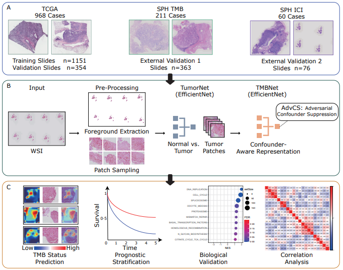
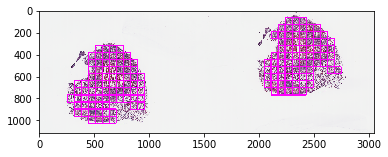

## 
This repository is a complete implementation of "Genopathomic profiling identifies signatures for immunotherapy response of lung adenocarcinoma via confounder-aware representation learning"

  
  
Pipeline

## Quick Start
### Downloading TCGA cohorts

Download the [GDC Data Transfer Tool](https://gdc.cancer.gov/access-data/gdc-data-transfer-tool) executable (not included here for license issues), and follow the instruction to download dataset.

### Preprocess TCGA data
Follow this [notebook](tcga/dataset/crop_img_with_openslide.ipynb) to preprocess dataset. this note book first crop TCGA image to patch, in our case the patch size is 512x512 on target magnitud 10x. then splite patches to train\val\test fold on whole image level.

  
  
Example of crop WSI to patches.

### Train && Val
After data download and pre-processing has been performed, 
follow this [notebook](tcga/tcga_tmb.ipynb) to train and validate model. More information about the training pipeline can be found in our paper.

